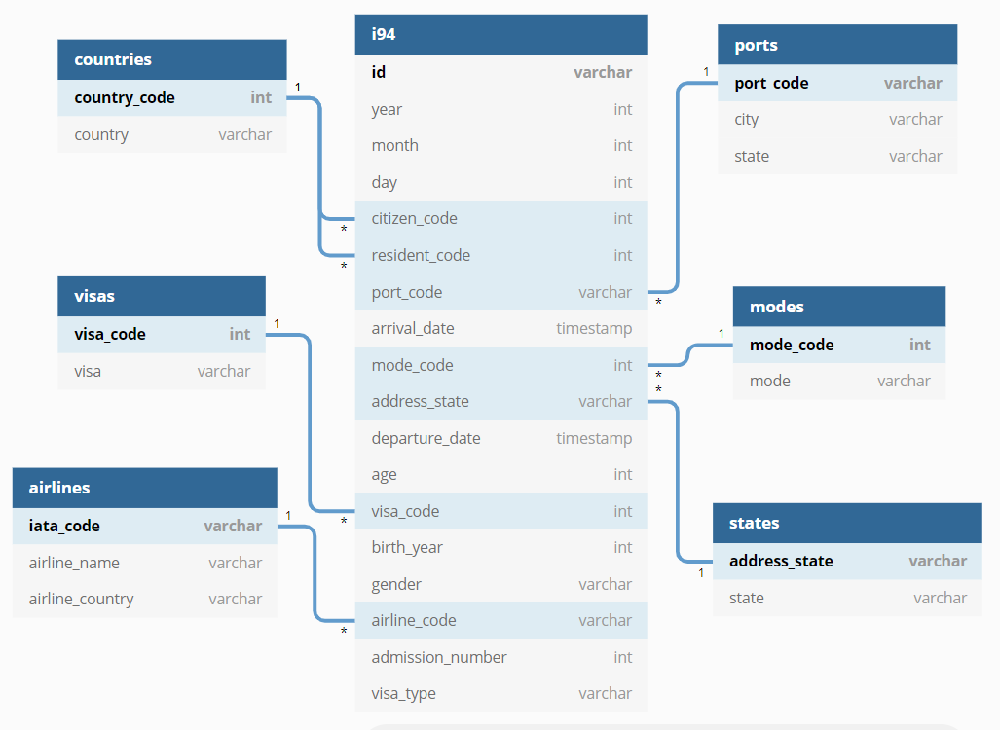

# US I94 Immigration Data Lake

## Contents

1. [Introduction](#Introduction)
2. [Project Description](#motivation)
3. [Scope the Project and Gather Data](#Datasets)
4. [Data Model](#Schema)
5. [Scripts](#Scripts)
6. [ETL Steps](#Steps)
7. [Getting Started](#Started)
8. [Final Write Up](#Writeup)

## Introduction

When entering the United States as a foreign visitor, the Customs Border Protection (CBP) officer examines your passpord and visa, then issues a small card called the Form I-94. This form, also named “Arrival/Departure Record”, is evidence of a nonimmigrant’s term of admission and used to document legal status in the United States, including length of stay and departure. 

The purpose of this project is to build an ETL pipeline that gathers all information about I94 records into a data lake allowing statistician and data scientist to be able to perform ad hoc data analysis and machine learning using the data. 

More information about I94 records can be found via here:

https://www.uscis.gov/I-94information 
https://studyinthestates.dhs.gov/student-forms?form=Form_I-94

## Scope the Project and Gather Data

The main dataset to be used in this project is the I94 immigration data provided by the US National Tourism and Trade Office. There are about 3 million I94 records being collected each month. To start up, I only consider the dataset from APRIL 2016, once the ETL went smoothly, I would like to ingest more data. All datasets exist in the workspace provided by Udacity, firstly I will upload all datasets onto Amazon S3. To process this big data, I would choose Spark to load data from S3, then manipulate and transform the data, finally store the output parquet format data back to S3. All data processing ETL will be deployed to Amazon EMR.   

These datasets will be included in the data lake:

#### I94 Immigration Data in 2016

- This data comes from the US National Tourism and Trade Office. [This](https://travel.trade.gov/research/reports/i94/historical/2016.html) is where the data comes from. This data is stored in 12 SAS tables of which each represents the month when the record was collected. Each table has about 3 million records. To test the ETL pipeline, we just use the table from April 2016.

||cicid|i94yr|i94mon|i94cit|i94res|i94port|arrdate|i94mode|i94addr|depdate|i94bir|i94visa|count|dtadfile|visapost|occup|entdepa|entdepd|entdepu|matflag|biryear|dtaddto|gender|insnum|airline|admnum|fltno|visatype

2027561|4084316.0|2016.0|4.0|209.0|209.0|HHW|20566.0|1.0|HI|20573.0|61.0|2.0|1.0|20160422|||G|O||M|1955.0|07202016|F||JL|56582674633.0|00782|WT
2171295|4422636.0|2016.0|4.0|582.0|582.0|MCA|20567.0|1.0|TX|20568.0|26.0|2.0|1.0|20160423|MTR||G|R||M|1990.0|10222016|M||*GA|94361995930.0|XBLNG|B2
589494|1195600.0|2016.0|4.0|148.0|112.0|OGG|20551.0|1.0|FL|20571.0|76.0|2.0|1.0|20160407|||G|O||M|1940.0|07052016|M||LH|55780468433.0|00464|WT
2631158|5291768.0|2016.0|4.0|297.0|297.0|LOS|20572.0|1.0|CA|20581.0|25.0|2.0|1.0|20160428|DOH||G|O||M|1991.0|10272016|M||QR|94789696030.0|00739|B2
3032257|985523.0|2016.0|4.0|111.0|111.0|CHM|20550.0|3.0|NY|20553.0|19.0|2.0|1.0|20160406|||Z|K||M|1997.0|07042016|F|||42322572633.0|LAND|WT
721257|1481650.0|2016.0|4.0|577.0|577.0|ATL|20552.0|1.0|GA|20606.0|51.0|2.0|1.0|20160408|||T|N||M|1965.0|10072016|M||DL|736852585.0|910|B2
1072780|2197173.0|2016.0|4.0|245.0|245.0|SFR|20556.0|1.0|CA|20635.0|48.0|2.0|1.0|20160412|||T|O||M|1968.0|10112016|F||CX|786312185.0|870|B2
112205|232708.0|2016.0|4.0|113.0|135.0|NYC|20546.0|1.0|NY|20554.0|33.0|2.0|1.0|20160402|||G|O||M|1983.0|06302016|F||BA|55474485033.0|00117|WT
2577162|5227851.0|2016.0|4.0|131.0|131.0|CHI|20572.0|1.0|IL|20575.0|39.0|2.0|1.0|20160428|||O|O||M|1977.0|07262016|||LX|59413424733.0|00008|WT

#### Code list of I94 Immigration Data

- FMTOUT.csv is generated from output_format.sas. It contains the code list of i94visa, i94mode, i94cit, i94res, i94addr, i94port

#### IATA Airlines Code

- A dataset listing the current IATA airline members, including the airline code and details. [Here](https://www.kaggle.com/guillaumekofi/iata-current-airline-members-2019#iata_airlines.csv) is where the data comes from.

## Data Model and Data Dictionary

Star Schema model is chosen to be implemented in this project. The statistician and data scientist can make simple queries on the data and perform high level analysis. 

The fact table contains i94 immigration data extracted from the i94 immigration dataset:

#### i94   (Extracted from i94 immigration dataset)

- **id** - A unique case Id combined with year, month, and cicid as primary key
- **year** - Year of arrival, extracted from arrival_date. 
- **month**: Month of arrival, extracted from arrival_date.
- **day** - Day of arrival, extracted from arrival_date. 
- **citizen_code** - 3 digit Visitor's citizenship code, extracted from i94cit.
- **resident_code** - 3 digit Visitor's country code of residence, extracted from i94res.
- **port_code** - 3 digit port of entry code, extracted from i94port.
- **arrival_date** - Date of arrival, converted from arrdate.
- **mode_code** - 1 digit code of entry mode, extracted from i94mode.
- **address_state** - The state where visitor stays? Extracted from i94addr.
- **departure_date** - Departure date, converted from depdate.
- **age** - Visitor's age, extracted from i94bir.
- **visa_code** - 1 digit visa category code, extracted from i94visa.
- **birth_year** - Visitor's birth year, extracted from biryear.
- **gender** - Visitor's gender, extracted from gender.
- **airline_code** - Airline code, extracted from airline.
- **admission_number** - Admission number, extracted from admnum.
- **visa_type** - Visa number, extracted from visatype.

These irrelevant variables will be dropped from the i94 immigration dataset: 

i94yr, i94mon: duplicated to the year and month extracted from arrival date.
count, dtadfile, visapost, entdepa, entdepd, entdepu, matflag, dtaddto, insnum, fltno: Information provded is unclear
occup: too many missing values.

Six dimension tables including airlines, ports, modes, countries, states, visas

#### airlines   (Extracted from iata_airlines dataset)

- **iata_code** - 2 digit IATA airpline code, extracted from IATADesignator.
- **airline_name** - Airline name, extracted from AirlineName.
- **airline_country** - Country of the airline, extracted from Country/Territory.

These irrelevant variables will be dropped from the airlines dataset:

3-DigitCode, ICAODesignator: other code information I don't need.

#### ports     (Extracted from i94port dataset)

- **port_code** - 3 digit port of entry code, extracted from START.
- **city** - The city where Port of enry locates, extracted from city.
- **state** - The state where Port of enry locates, extracted from state.

#### modes     (Extracted from i94mode dataset)

- **mode_code** - 1 digit mode of entry code, extracted from START.
- **mode** - mode of entry, extracted from LABEL.

#### countries     (Extracted from i94cit_res dataset)

- **country_code** -  3 digit country code, extracted from START.
- **country** - Country name, extracted from LABEL .    

#### states     (Extracted from i94addr dataset)

- **address_state** -  State abbreviation, extracted from START.
- **state** - Full state name, extracted from LABEL.   

#### visas     (Extracted from i94visa dataset)

- **visa_code** -  1 digit visa category code, extracted from START.
- **visa** - Visa category name, extracted from LABEL. 

## Scripts 

- **dl.cfg** - A configuration file storing your AWS credentials  

- **output_format.sas** - Generates a code list table FMTOUT.csv  

- **split_fmtout.py** - Reads FMTOUT.csv, then generates five code list CSVs. 

- **etl.py** - Reads data from your S3 bucket, processes the data, then write to parquet file back to S3 bucket . 

- **upload_to_s3.py** - Uploads all project datasets, etl.py, dl.cfg onto your S3 bucket 

- **deploy_emr.py** - Creates an AWS EMR cluster, copies etl.py and dl.cfg onto the cluster, processes the pipeline on the cluster, terminates the cluster when the task fails or completes.                 

## Getting Started 

Here is the steps necessary to pipeline the data into the star schema

1. Run output_format.sas on SAS, generate FMTOUT.csv. If you don't have SAS, don't worry. I have already created an FMTOUT.csv for you.

2. Run split_fmtout.py. The program will split FMTOUT.csv into multiple i94 code CSVs, also clean these CSVs as well.

`python split_fmtout.py`

3. Open dl_template.cfg, enter your AWS credentials, then save the file by renaming as dl.cfg.

4. Run upload_to_s3.py. It will upload all project required files onto your s3.

`python upload_to_s3.py`

5. Run deploy_emr.py. The ETL pipeline will be processed. Go to your EMR cluster page, to verify the output.

`python deploy_emr.py`

## Final Write Up

### Clearly state the rationale for the choice of tools and technologies for the project.

- Stored the project data in the cloud based Amazon S3, which has high performance and scalability, as well as easier connected with other AWS tools.

- Spark is chosen to perform massive parallel data processing.

- Python is being used in every step, because Python has powerful open source packages, which enable data analysis and manipulation, as well as a complete API access to various platforms, such as Spark, AWS, Linux. 

- The ETL process will be run on Amazon EMR, a clouded based cluster that has Hadoop/Spark pre-installed, can be easily running the analysis script without worrying the cluster's configuration. Also, a better connection performance with its own storage product S3 where we store the raw data.

###  Propose how often the data should be updated and why.

- The date comes monthly in SAS format, hence updated the data monthly is definitely possible. In fact, the data processing ETL on the cloud just takes a few minutes to be finished. 

### Write a description of how you would approach the problem differently under the following scenarios:

#### The data was increased by 100x.
 
- This can refer to a scenario that we need to process 10 years of I94 Immigration data. As Spark can be used on massive parallel processing, as long as we increase the number of nodes by hiring more machines when deploying to EMR. Currently I use 4 notes on EMR, if I increase the note number to 40, the performance will increase likely 10x.  
 
#### The data populates a dashboard that must be updated on a daily basis by 7am every day.
 
- The ELT pipeline can be done in a few minutes, there is enough time to review the job workflow and report everyday. It should not be a problem running the workflow everyday.
 
#### The database needed to be accessed by 100+ people.
 
- Assumed these people just make a query to the S3 occasionally, then we can consider using Amazon Athena. It provides SQL query to the S3 data. Athena API has a limit number of calls varying from 5 to 100 per second depended on the API name being called, can burst up to 10 to 200 calls per second. I think it's reasonable for the capacity of a hundred users.  